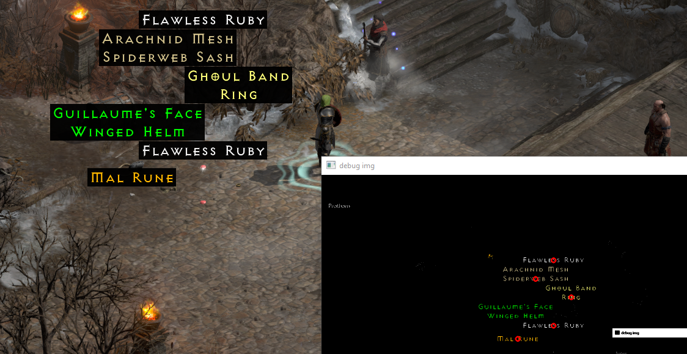

# 

Simple Pixelbot for Diablo 2 Resurrected written in python and opencv. Obviously only use it in offline mode as it is against the TOS of Blizzard to use it in online mode! [**Download here**](https://github.com/aeon0/botty/releases)

Join the [**Discord Channel**](https://discord.gg/CnkfsjqN) for help and discussions.

[](https://vimeo.com/641410429)

## What it does
- Run Pindle, Eldtritch, Shenk
- Pickit with per item config
- Stash picked up items (using all 4 stashes)
- Prebuff
- Revive Merc if dead
- Heal at Malah if needed
- Take potions (health and mana) and chicken if in trouble during fights
- Check for death. In this case start another game and pick up corpse.
- Supported builds: Sorceress (Blizz, Light, Meteor), Hammerdin
- Debug color checker to easily verify your settings
- Runs in Hyper-V

## Getting started
### 1) Graphics and Gameplay Settings
All settings will automatically be set when you execute `run.exe` and press the hotkey for "Adjust D2R settings" (default f9). Note that D2R should not run during this process, or if it does you will have to restart afterwards. The important ones are listed here:

- Resolution: 1920x1080 (Fullscreen)
- Gamma: 155
- Item Label Display: Hold
- Large Font Mode: on

**Note**: There have been issues reported with image sharpening being truned on via the graphic card settings itself outside of D2R. Try turning it off when running the bot.

### 2) Supported builds
#### Soceress
You can put any skills on left and right attack and see if it works out. E.g. Glacial Spike on left attack and Blizzard or right attack.
Adjust the hotkeys in the __param.ini__ for the `[char]` and `[sorceress]` section accordingly. Check out the param.ini section in the Readme for more details on each param.
#### Hammerdin
Your standard Hammerdin with Enigma. Dont think I have to explain much here.

### 3) Start Location
Open up D2R and wait till you are at the hero selection screen. Make sure the char you running with is selected and will be in A5 hell when starting a hell game.

### 5) Start Botty
Download the a prebuilt release [here](https://github.com/aeon0/botty/releases). Start `run.exe` in the botty folder, go to D2R window and press the "resume" key. Move to your D2R window and press "f11". You can always force stop botty with f12.

## Color Test Mode
To check if you graphic settings are good and if the bot would pick up items there is a **Color Test Mode** built in. Start botty and press F10 (Default key). This will open up a (mostly black) window. Start a game in D2R and throw some items of different type on the ground. If you now bring forward the debug window all items should show up with their names while the background is black. If you throw an item on the ground that should be picked up, it will have a red circle.</br>


## Development
Check out the [development.md](development.md) docu for infos on how to build from source and details of the project structure and code.

## param.ini
To ease the switch to new botty versions, you can also overwrite any of the param.ini fields in a __custom.ini__ file. When a new version of botty is released you just copy the file to the new version without having to port all your __param.ini__ changes to the new version. Example:
```ini
; custom.ini - overwrites 3 params in the param.ini
[general]
monitor=1

[routes]
run_pindle=1
run_shenk=0
```

 [general]                      | Descriptions                                
--------------------------------|---------------------------------------------
monitor | Select on which monitor D2R is running in case multiple are available
min_game_length_s | Games must have at least this length, will wait in hero selection for if game is too quick (to avoid server connection issues)
exit_key | Pressing this key (anywhere), will force botty to shut down
resume_key | After starting the exe botty will wait for this keypress to atually start botting away
color_checker_key | Pressing this key will start a debug mode to check if the color filtering works with your settings. It also includes the item search and marks items it would pick up with red circles

 [routes]                       | Descriptions                                
--------------------------------|---------------------------------------------
run_pindle | Run Pindle in each new game. Select "1" to run it "0" to leave it out.
run_shenk | Run shenk in each new game. Select "1" to run it "0" to leave it out.

 [char]                         | Descriptions                                
--------------------------------|---------------------------------------------
type | Build type. Currently only "sorceress" or "hammerdin" is supported
casting_frames | Depending on your char and fcr you will have a specific casting frame count. Check it here: https://diablo2.diablowiki.net/Breakpoints and fill in the right number. Determines how much delay there is after each teleport for example.
slow_walk | With this set to 1 the char will have a large delay for each running action in town. Set this to 1 if you keep getting stuck during traversing town.
num_loot_columns | Number of columns in inventory used for loot (from left!). Remaining space can be used for charms
take_health_potion | Health percentage when healing potion will be used
take_mana_potion | Mana percentage when mana potion will be used. Currently belt managment is not very clever and it is safest to only pick up health pots and make sure mana reg is enough for pindle to not need mana pots.
heal_merc | Merc health percentage when giving healing potion to merc
chicken | Health percentage when chicken (leaving game)
show_items | Hotkey for "show items"
inventory_screen | Hotkey to open up inventory
stand_still | Hotkey for "stand still". Note this can not be the default shift key as it would interfere with the merc healing routine.
show_belt | Hotkey for "show belt"
potion1 | Hotkey to take poition in slot 1
potion2 | Hotkey to take poition in slot 2
potion3 | Hotkey to take poition in slot 3
potion4 | Hotkey to take poition in slot 4
cta_available | 0: no cta available, 1: cta is available and should be used during prebuff
weapon_switch | Hotkey for "weapon switch" (only needed if cta_available=1)
battle_order | Hotkey for battle order from cta (only needed if cta_available=1)
battle_command | Hotkey for battle command from cta (only needed if cta_available=1)

 [sorceress]                    | Descriptions                                
--------------------------------|---------------------------------------------
teleport | Hotkey for teleport
skill_left | Hotkey for skill that is used on left mouse btn (e.g. Glacial Spike)
skill_right | Hotkey for skill that is used on right mouse btn (e.g. Blizzard)
forzen_armor | Hotkey for frozen armor (or any of the other armors)
telekinesis | Hotkey for telekinesis

 [hammerdin]                    | Descriptions                                
--------------------------------|---------------------------------------------
teleport | Hotkey for teleport
concentration | Hotkey for Concentration
redemption | Hotkey for redemption
holy_shield | Hotkey for Holy Shield
blessed_hammer | Hotkey for Blessed Hammer

 [items]                        | Descriptions                                
--------------------------------|---------------------------------------------
item_type | Select "1" if item should be picked up, "0" if not.

## Support this project
This project is free. Support it by contributing in any technical way, giving feedback, PRs or by submitting issues. That being said, I am not above accepting some pixel currency :) So if you want to send some fg my way to keep my dopamine high, here is my jsp: [jojo22](https://forums.d2jsp.org/user.php?i=768967).
