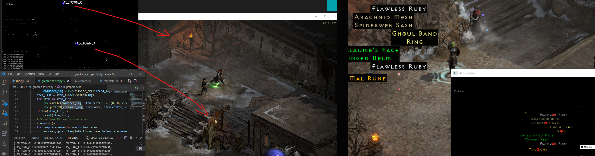

# 

Pixelbot for Diablo 2 Resurrected. This project is for informational and educational purposes only and is not meant for online usage. Feel free to dig around, add stuff, make PRs, or ask questions should you get stuck!

[**Download here**](https://github.com/aeon0/botty/releases) and got to have a [**Discord**](https://discord.gg/Jf3J8cuXWg) nowadays I guess :man_shrugging:

## Getting started & Prequists
- D2r needs to be in English Language,
- Botty currently works with 720p D2r window (will be adjusted automatically on auto settings)

### 1) Graphics and Gameplay Settings

All settings will automatically be set when you execute `main.exe` and press the hotkey for "Adjust D2R settings" (default f9). It is not a 100% thing, in rare cases you might still have to fiddle around with your brightness. I suggest using the "Graphic Debugger" to verify your settings.
**Note**: Make sure that no other external programs adapt your graphics settings (HDR, Geforce Experience, etc.)

### 2) Supported builds

Check the documentation for **param.ini** further down. Different Sorc builds, Hammardin, Barb, Trapsin are already implemented to different extents. It is quite straightforward to implement new classes. Give it a go if you like!

### 3) Start Location

Open up D2R and wait till you are at the hero selection screen. Make sure the char you running with is selected and will be in any of Act 3, 4 or 5 in the respective difficulty you set in the **param.ini** once the bot starts the game.

### 4) Start Botty

You can either run from python. Follow [development.md](development.md) for that. Or you download the a prebuilt release [here](https://github.com/aeon0/botty/releases) (the .rar file!). Start `main.exe` in the botty folder. Focus your D2R window and press the start key (default f11). You can always force stop botty with f12. Note: Botty will use the /nopickup command in the first game to avoid pickup up trash while traversing. This command will only allow item pickup when "show items" is active.

## Graphic Debugger

To check if you graphic settings are good and if the bot would pick up items there is a **Graphic Debugger Mode**. Start botty and press F10 (Default key). This will open up a (mostly black) window. Start a game in D2R and go to A5. You should see some templates with blue circles detected and scores printed out to the console. To check item finding, throw some items of different types on the ground. The debug window should show the item names with black background. If you throw an item on the ground that should be picked up, it will have a red circle. The console will print out the scores for each item that would be picked up. Scores should be well above 0.9 for these items.</br>


## Development

Check out the [development.md](development.md) docu for infos on how to build from source and details of the project structure and code.

## param.ini

All botty configuration files are located in the __config__ folder. To ease the switch to new botty versions, you can also overwrite any of the .ini fields in a **custom.ini** file. When a new version of botty is released you just copy the file to the new version without having to port all your **param.ini** changes to the new version. Example:

```ini
; custom.ini - overwrites 3 params in the param.ini
[general]
name=MyCustomName

[routes]
run_pindle=1
run_shenk=0
```

| [general]                | Descriptions              |
| --------------------     | --------------------------|
| name                     | Name used in terminal and discord messages |
| custom_message_hook      | Add your own message hook here to get messages about drops and botty status updates, discord webhook is default  |
| logger_lvl               | Can be any of [info, debug] and determines how much output you see on the command line |
| max_game_length_s        | Botty will attempt to stop whatever its doing and try to restart a new game. Note if this fails, botty will attempt to shut down D2R and Bnet     |
| max_consecutive_fails    | Botty will stop making games if the number of consecutive fails reaches this max value     |
| randomize_runs           | 0: the order will be as seen in the params.ini. 1: the order will be random |
| difficulty               | Set to `normal` `nightmare` or `hell` for game difficulty |
| message_api_type         | Which api to use to send botty messages.  Supports "generic_api" (basic discord), or "discord" (discord embeds with images).
| discord_status_count     | Number of games between discord status messges being sent. Leave empty for no status reports.
| discord_status_condensed | Toggles condensed view of Discord status messages. 0 Full text, 1 Condensed text.
| info_screenshots         | If 1, the bot takes a screenshot with timestamp on every stuck / chicken / timeout / inventory full event. This is 1 by Default, so remember to clean up the folder every once in a while |
| loot_screenshots         | If 1, the bot takes a screenshot with timestamp everytime he presses show_items button and saves it to loot_screenshots folder. Remember to clear them once in a while... |
| saved_games_folder       | Optional folder path of Diablo 2 : Ressurrected saved games that will be used to overwrite when running the "auto settings" |
| d2r_path                 | Optional path to find the d2r.exe, if not set will be default to "C:\Program Files (x86)\Diablo II Resurrected\D2R.exe" when attempting to restart |
| restart_d2r_when_stuck   | Set to `1` and botty will attempt to restart d2r in the case that botty is unable to recover its state (e.g: game crash) |

| [routes]     | Descriptions                                                             |
| ------------ | ------------------------------------------------------------------------ |
| run_trav     | Run Trav in each new game. Select "1" to run it "0" to leave it out. Specific trav gear is suggested |
| run_pindle   | Run Pindle in each new game. Select "1" to run it "0" to leave it out.   |
| run_eldritch | Run Eldritch in each new game. Select "1" to run it "0" to leave it out. |
| run_shenk    | Run shenk in each new game. Select "1" to run it "0" to leave it out.    |
| run_nihlathak | Run Nihlathak in each new game. Select "1" to run it "0" to leave it out. (Teleport required) |
| run_arcane   | Run Arcane Sanctuary in each new game. Select "1" to run it "0" to leave it out. (Teleport required) |
| run_diablo   | Run Diablo in each new game. Select "1" to run it "0" to leave it out. (Teleport required) |

| [char]             | Descriptions |
| ------------------ | -------------------------------------------------------------------------------------------------|
| type               | Build type. Currently only "sorceress" or "hammerdin" is supported |
| casting_frames     | Depending on your char and fcr you will have a specific casting frame count. Check it here: https://diablo2.diablowiki.net/Breakpoints and fill in the right number. Determines how much delay there is after each teleport for example. If your system has some delay e.g. on vms, you might have to increase this value above the suggest value in the table! |
| num_loot_columns   | Number of columns in inventory used for loot (from left!). Remaining space can be used for charms |
| show_items         | Hotkey for "show items" |
| inventory_screen   | Hotkey to open inventory |
| force_move         | Hotkey for "force move" |
| stand_still        | Hotkey for "stand still". Note this can not be the default shift key as it would interfere with the merc healing routine |
| tp                 | Hotkey for using a town |
| belt_rows          | Integer value of how many rows the char's belt has |
| show_belt          | Hotkey for "show belt" |
| potion1            | Hotkey to take potion in slot 1 |
| potion2            | Hotkey to take potion in slot 2 |
| potion3            | Hotkey to take potion in slot 3 |
| potion4            | Hotkey to take potion in slot 4 |
| cta_available      | 0: no cta available, 1: cta is available and should be used during prebuff |
| weapon_switch      | Hotkey for "weapon switch" (only needed if cta_available=1) |
| battle_order       | Hotkey for battle order from cta (only needed if cta_available=1) |
| battle_command     | Hotkey for battle command from cta (only needed if cta_available=1) |
| stash_gold         | Bool value to stash gold each time when stashing items |
| gold_trav_only     | Hacky config that will restrict gold pickup to trav only. misc_gold must be set to 1 for this to have any effect |
| use_merc           | Set to 1 for using merc. Set to 0 for not using merc (will not revive merc when dead), default = 1 |
| atk_len_arc        | Attack length for hdin/sorc fighting arcane  |
| atk_len_trav       | Attack length for hdin fighting trav (note this atk length will be applied in 4 different spots each) |
| atk_len_pindle     | Attack length for hdin or number of attack sequences for sorc when fighting pindle |
| atk_len_eldritch   | Attack length for hdin or number of attack sequences for sorc when fighting eldritch |
| atk_len_shenk      | Attack length for hdin or number of attack sequences for sorc when fighting shenk |
| atk_len_nihlathak   | Attack length for hdin or number of attack sequences for sorc when fighting nihlathak |
| atk_len_cs_trashmobs   | Attack length for hdin or number of attack sequences when fighting Trash Mobs in Chaos Sanctuary (Diablo) |
| atk_len_diablo_vizier   | Attack length for hdin or number of attack sequences when fighting Sealboss A "Vizier of Chaos" in Chaos Sanctuary (Diablo) |
| atk_len_diablo_deseis   | Attack length for hdin or number of attack sequences when fighting Sealboss B "Lord De Seis" in Chaos Sanctuary (Diablo) |
| atk_len_diablo_infector   | Attack length for hdin or number of attack sequences when fighting Sealboss C "Infector of Souls" in Chaos Sanctuary (Diablo) |
| atk_len_diablo_infector   | Attack length for hdin or number of attack sequences when fighting Diablo in Chaos Sanctuary |
| kill_cs_trash   | If 1, most Trash mob packs from Chaos Sancturay Entrance to Pentagram are cleared. If 0, the run starts at Pentagram and just kills Sealbosses & Diablo (default) |
| cs_town_visits   | If 1, it will go to town, buy pots & stash items between clearing the seals, set 0 to deactivate (default) |
| take_health_potion | Health percentage when healing potion will be used. e.g. 0.6 = 60% helath |
| take_mana_potion   | Mana percentage when mana potion will be used |
| take_rejuv_potion_health | Health percentag when rejuv potion will be used |
| take_rejuv_potion_mana   | Mana percentag when rejuv potion will be used |
| heal_merc          | Merc health percentage when giving healing potion to merc |
| heal_rejuv_merc    | Merc health percentage when giving rejuv potion to merc |
| chicken            | Will chicken (leave game) when player health percentage drops below set value, range 0 to 1. Set to 0 to not chicken. |
| merc_chicken       | Will chicken (leave game) when merc health percentage drops below set value, range 0 to 1. Set to 0 to not chicken. |
| belt_rejuv_columns | Number of belt columns for rejuv potions |
| belt_hp_columns    | Number of belt columns for healing potions |
| belt_mp_columns    | Number of belt columns for mana potions |
| pre_buff_every_run | 0: Will only prebuff on first run, 1: Will prebuff after each run/boss |
| runs_per_stash    | 0: Will only stash after intentional item pickup, 1+: Will force stash after # of runs set here (recommend at least 4 in case of accidental pickups) |
| runs_per_repair    | 0: Will only repair when needed, 1+: Will force repair after # of runs set here |
| id_items           | Will identify items at cain before stashing them. Cain must be rescued for this to work.|
| open_chests        | Open up chests in some places. E.g. on dead ends of arcane. Note: currently bad runtime. |
| fill_shared_stash_first | Fill stash tabs starting from right to left, filling personal stash last |
| gamble_items       | List of items to gamble when stash fills with gold. Leave blank to disable. Supported items currently include circlet, ring, coronet, talon, amulet

| [transmute]             | Descriptions |
| ------------------ | -------------------------------------------------------------------------------------------------|
| transmute_every_x_game               | How often to run transmute routine (currently transmutes flawless gems into perfect gems). Transmute routine depends on stashing routine it will only start after items stashing is done. E.g. so it could take more than X games to perform transmutes if there were no items to stash at the time. Default: 20  |
| stash_destination | Stash tabs by priority to place the results of the transmute. Default: 3,2,1,0. (It means the result will be first placed in stash 3 untils it's full, then to stash 2, etc. 0 - personal tab)

### Builds
| [sorceress]   | Descriptions                                                                  |
| ------------- | ----------------------------------------------------------------------------- |
| teleport      | Required Hotkey for teleport                                                  |
| frozen_armor  | Optional Hotkey for frozen armor (or any of the other armors)                 |
| energy_shield | Optional Hotkey for energy shield                                             |
| thunder_storm | Optional Hotkey for thunder storm                                             |

| [light_sorc]  | Descriptions                                                                  |
| ------------- | ----------------------------------------------------------------------------- |
| chain_lightning | Optional Hotkey for chain_lightning (must be bound to left skill)           |
| lightning     | Required Hotkey for lightning (must be bound to right skill)                  |

| [blizz_sorc]  | Descriptions                                                                  |
| ------------- | ----------------------------------------------------------------------------- |
| ice_blast     | Optional Hotkey for ice_blast (must be bound to left skill)                   |
| blizzard      | Required Hotkey for Blizzard (must be bound to right skill)                   |

| [nova_sorc]   | Descriptions                                                                  |
| ------------- | ----------------------------------------------------------------------------- |
| nova          | Required Hotkey for Nova (must be bound to right skill)                       |

| [hammerdin]    | Descriptions                                                                        |
| -------------- | ----------------------------------------------------------------------------------- |
| teleport       | Optional Hotkey for teleport. If left empty hammerdin will run instead of teleport. |
| concentration  | Required Hotkey for Concentration                                                   |
| holy_shield    | Required Hotkey for Holy Shield                                                     |
| blessed_hammer | Required Hotkey for Blessed Hammer. (must be bound to left skill!)                  |
| redemption     | Optional Hotkey for Redemption                                                      |
| vigor          | Optional Hotkey for Vigor                                                           |
| cleansing      | Optional Hotkey for Cleansing                                                       |

| [trapsin]    | Descriptions                                                                          |
| -------------- | ----------------------------------------------------------------------------------- |
| teleport       | Optional Hotkey for teleport. If left empty trapsin will run instead of teleport.   |
| skill_left     | Optional Hotkey for Left Skill                                                      |
| burst_of_speed | Optional Hotkey for Burst of Speed                                                  |
| fade           | Optional Hotkey for Fade                                                            |
| shadow_warrior | Optional Hotkey for Shadow Warrior                                                  |
| lightning_sentry | Required Hotkey for Lightning Sentry                                              |
| death_sentry   | Required Hotkey for Death Sentry                                                    |
| cloak_of_shadows| Optional Hotkey for Cloak of Shadows                                                |
|  mind_blast    | Optional Hotkey for Mind Blast                                                      |

| [barbarian]    | Descriptions                                                                        |
| -------------- | ----------------------------------------------------------------------------------- |
| teleport       | Optional Hotkey for teleport. If left empty barb will run instead of teleport.      |
| leap           | Required Hotkey for Leap                                                            |
| shout          | Required Hotkey for Shout                                                           |
| war_cry        | Required Hotkey for War Cry                                                         |
| find_item      | Optional Hotkey for Find Item                                                       |
| cry_frequency  | Time in seconds between each cast of war_cry. Set to 0.0 if max fcr should be used  |

| [Necro]        | Descriptions                                                                        |
| -------------- | ----------------------------------------------------------------------------------- |
| teleport       | leave this blank for now, teleport/static pathing is currently not supported        |
| skill_left     | Required Hotkey for attack (bonespear/teeth)                                        |
| bone_armor     | Required Hotkey for Bone Armor                                                      |
| clay_golem     | Required Hotkey for Clay Golem                                                      |
| raise_skeleton | Required Hotkey for Raise Skeleton                                                  |
| amp_dmg        | Required Hotkey for Amplify Damage                                                  |
| corpse_explosion | Required Hotkey Corpse Explosion                                                  |
| raise_revive   | Required Hotkey revive                                                              |
| clear_pindle_packs | clears mobs before pindle                                                       |

| [dclone]             | Descriptions                                                          |
| -------------------- | --------------------------------------------------------------------- |
| region_ips           | Start of the region ip you want to filter for. e.g. EU Server = 37.244.11, 37.244.48 |
| dclone_hotip         | Hot ip you are looking for. Botty will stay in game and message you if a message_hook is set |

| [advanced_options]   | Descriptions                                                          |
| -------------------- | --------------------------------------------------------------------- |
| pathing_delay_factor | A linear scaling factor, between 1 and 10, applied to pathing delays. |
| message_headers      | Headers that are sent with each messages                              |
| message_body_template | Message body of the post message sent                                |

## Support this project

Support it by contributing in any technical way, giving feedback, bug reports or submitting PRs.
