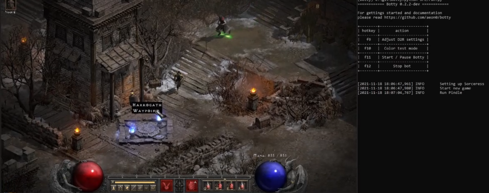

# 

Simple Pixelbot for Diablo 2 Resurrected single player written in python and opencv. Botty does not work for online games and is not intended for this usage!
[**Download here**](https://github.com/aeon0/botty/releases). Got to have a [**Discord**](https://discord.gg/Jf3J8cuXWg) nowadays I guess :man_shrugging:

And please. I urge you to actually read that README! It will make your life a lot easier.

[](https://streamable.com/67h9ay)

## Getting started

Botty only supports English language! Botty is currently working in 720p and will either switch to windowed mode or to fullscreen depending on your current monitor res when you run the "Auto Settings".</br>
It is highly recommended to let botty run with /nopickup active. This will reduce the amount of accidently picked up trash by a lot. Espacially when playing builds without teleport.

### 1) Graphics and Gameplay Settings

All settings will automatically be set when you execute `main.exe` and press the hotkey for "Adjust D2R settings" (default f9). Note that D2R should not run during this process, or if it does you will have to restart afterwards. It is not a 100% thing, in rare cases you might still have to fiddle around with your brightness. I suggest using the "Graphic Debugger" to verify your settings.
**Note**: There have been issues reported with image sharpening being truned on via the graphic card settings itself outside of D2R. Try turning it off when running botty. Also HDR should be truned off.

### 2) Supported builds

Check the documentation for **param.ini** further down. Currently you can set skills for Sorceress, Hammardin and Trapsin. The later two can also be set up without teleport.

#### Other builds

You can "highjack" any config to also run other builds. Or properly implement a new build and make a PR : )

### 3) Start Location

Open up D2R and wait till you are at the hero selection screen. Make sure the char you running with is selected and will be in A5 in the respective difficulty you set in the **param.ini** once the bot starts the game.

### 4) Start Botty

You can either run from python. Follow [development.md](development.md) for that. Or you download the a prebuilt release [here](https://github.com/aeon0/botty/releases). Start `main.exe` in the botty folder. Focus your D2R window window and press the start key (default f11). You can always force stop botty with f12.

## Graphic Debugger

To check if you graphic settings are good and if the bot would pick up items there is a **Graphic Debugger Mode** built in. Start botty and press F10 (Default key). This will open up a (mostly black) window. Start a game in D2R and go to A5. You should see some templates with blue circles detected and scores printed out to the console. E.g. for 720p you should see scores higher 0.8 for the templates. To check item finding, throw some items of different types on the ground. The debug window should show the item names with black background. If you throw an item on the ground that should be picked up, it will have a red circle. The console will print out the scores for each item that would be picked up. Scores should be well above 0.9 for these items.</br>


## Development

Check out the [development.md](development.md) docu for infos on how to build from source and details of the project structure and code.

## param.ini

To ease the switch to new botty versions, you can also overwrite any of the param.ini fields in a **custom.ini** file. When a new version of botty is released you just copy the file to the new version without having to port all your **param.ini** changes to the new version. Example:

```ini
; custom.ini - overwrites 3 params in the param.ini
[general]
monitor=1

[routes]
run_pindle=1
run_shenk=0
```

| [general]            | Descriptions              |
| -------------------- | --------------------------|
| name                 | Name used in terminal and discord messages |
| saved_games_folder   | Optional folder path of Diablo 2 : Ressurrected saved games |
| monitor              | Select on which monitor D2R is running in case multiple are available |
| max_game_length_s    | Botty will attempt to stop whatever its doing and try to restart a new game. Note if this fails, botty will attempt to shut down D2R and Bnet |
| exit_key             | Pressing this key (anywhere), will force botty to shut down |
| resume_key           | After starting the exe botty will wait for this keypress to atually start botting away |
| graphic_debugger_key | Pressing this key will start a debug mode to check if the color filtering works with your settings. It also includes the item search and marks items it would pick up with red circles    |
| logger_lvl           | Can be any of [info, debug] and determines how much output you see on the command line |
| randomize_runs       | If 0, the order will always be pindle -> eldritch/shenk. If 1 the order will be random |
| difficulty           | Set to `normal` `nightmare` or `hell` for game difficulty |
| custom_message_hook  | Add your own message hook here to get messages about drops and in case botty got stuck and can not resume, discord webhook is default  |
| discord_status_count | Number of games between discord status messges being sent. Leave empty for no status reports.
| info_screenshots     | If 1, the bot takes a screenshot with timestamp on every stuck / chicken / timeout / inventory full event. This is 1 by Default, so remember to clean up the folder every once in a while |
| loot_screenshots     | If 1, the bot takes a screenshot with timestamp everytime he presses show_items button and saves it to loot_screenshots folder. Remember to clear them once in a while... |

| [routes]     | Descriptions                                                             |
| ------------ | ------------------------------------------------------------------------ |
| run_trav     | Run Trav in each new game. Select "1" to run it "0" to leave it out. Specific trav gear is suggested |
| run_pindle   | Run Pindle in each new game. Select "1" to run it "0" to leave it out.   |
| run_eldritch | Run Eldritch in each new game. Select "1" to run it "0" to leave it out. |
| run_shenk    | Run shenk in each new game. Select "1" to run it "0" to leave it out.    |
| run_nihlatak | Run Nihlatak in each new game. Select "1" to run it "0" to leave it out. (Teleport required) |

| [char]             | Descriptions |
| ------------------ | -------------------------------------------------------------------------------------------------|
| type               | Build type. Currently only "sorceress" or "hammerdin" is supported |
| casting_frames     | Depending on your char and fcr you will have a specific casting frame count. Check it here: https://diablo2.diablowiki.net/Breakpoints and fill in the right number. Determines how much delay there is after each teleport for example. |
| stash_gold         | Bool value to stash gold each time when stashing items |
| gold_trav_only     | Hacky config that will restrict gold pickup to trav only. misc_gold must be set to 1 for this to have any effect |
| use_merc           | Set to 1 for using merc. Set to 0 for not using merc (will not revive merc when dead), default = 1 |
| atk_len_trav       | Attack length for hdin fighting trav (note this atk length will be applied in 4 different spots each) |
| atk_len_pindle     | Attack length for hdin or number of attack sequences for sorc when fighting pindle |
| atk_len_eldritch   | Attack length for hdin or number of attack sequences for sorc when fighting eldritch |
| atk_len_shenk      | Attack length for hdin or number of attack sequences for sorc when fighting shenk |
| num_loot_columns   | Number of columns in inventory used for loot (from left!). Remaining space can be used for charms |
| take_health_potion | Health percentage when healing potion will be used |
| take_mana_potion   | Mana percentage when mana potion will be used. Currently belt managment is not very clever and it is safest to only pick up health pots and make sure mana reg is enough for pindle to not need mana pots. |
| heal_merc          | Merc health percentage when giving healing potion to merc |
| chicken            | Will chicken (leave game) when player health percentage drops below set value, range 0 to 1. Set to 0 to not chicken. |
| merc_chicken       | Will chicken (leave game) when merc health percentage drops below set value, range 0 to 1. Set to 0 to not chicken. |
| show_items         | Hotkey for "show |
| inventory_screen   | Hotkey to open up |
| stand_still        | Hotkey for "stand still". Note this can not be the default shift key as it would interfere with the merc healing routine. |
| force_move         | Hotkey for "force move" |
| tp                 | Hotkey for using a town |
| belt_rows          | Integer value of how many rows the char's belt has |
| show_belt          | Hotkey for "show |
| potion1            | Hotkey to take potion in slot |
| potion2            | Hotkey to take potion in slot |
| potion3            | Hotkey to take potion in slot |
| potion4            | Hotkey to take potion in slot  |
| belt_rejuv_columns | Number of belt columns for rejuv potions |
| belt_hp_columns    | Number of belt columns for healing potions |
| belt_mp_columns    | Number of belt columns for mana potions |
| pre_buff_every_run | 0: Will only prebuff on first run, 1: Will prebuff after each run/boss |
| cta_available      | 0: no cta available, 1: cta is available and should be used during prebuff |
| weapon_switch      | Hotkey for "weapon switch" (only needed if cta_available=1) |
| battle_order       | Hotkey for battle order from cta (only needed if cta_available=1) |
| battle_command     | Hotkey for battle command from cta (only needed if cta_available=1) |

| [sorceress]   | Descriptions                                                                  |
| ------------- | ----------------------------------------------------------------------------- |
| teleport      | Required Hotkey for teleport                                                  |
| skill_left    | Required Hotkey for skill that is used on left mouse btn (e.g. Glacial Spike) |
| skill_right   | Required Hotkey for skill that is used on right mouse btn (e.g. Blizzard)     |
| frozen_armor  | Optional Hotkey for frozen armor (or any of the other armors)                 |
| energy_shield | Optional Hotkey for energy shield                                             |
| thunder_storm | Optional Hotkey for thunder storm                                             |

| [hammerdin]    | Descriptions                                                                        |
| -------------- | ----------------------------------------------------------------------------------- |
| teleport       | Optional Hotkey for teleport. If left empty hammerdin will run instead of teleport. |
| concentration  | Required Hotkey for Concentration                                                   |
| holy_shield    | Hotkey for Holy Shield                                                              |
| blessed_hammer | Hotkey for Blessed Hammer                                                           |
| redemption     | Optional Hotkey for redemption                                                      |
| vigor          | Optional Hotkey for vigor                                                           |

| [trapsin]    | Descriptions                                                                        |
| -------------- | ----------------------------------------------------------------------------------- |
| teleport       | Optional Hotkey for teleport. If left empty trapsin will run instead of teleport.   |
| skill_left     | Optional Hotkey for Left Skill                                                      |
| burst_of_speed | Optional Hotkey for Burst of Speed                                                  |
| fade           | Optional Hotkey for Fade                                                            |
| shadow_warrior | Optional Hotkey for Shadow Warrior                                                  |
| lightning_sentry | Required Hotkey for Lightning Sentry                                              |
| death_sentry   | Required Hotkey for Death Sentry                                              |

| [advanced_options]   | Descriptions                                                          |
| -------------------- | --------------------------------------------------------------------- |
| pathing_delay_factor | A linear scaling factor, between 1 and 10, applied to pathing delays. |

## Support this project

Support it by contributing in any technical way, giving feedback, bug reports or submitting PRs.
