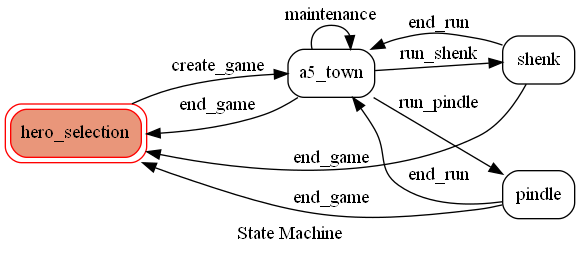
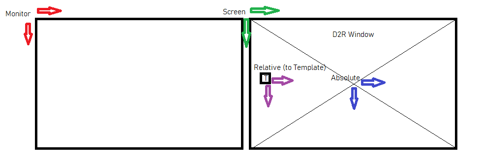

# Dev Docu

## Dependencies
- Install latest miniconda (https://docs.conda.io/en/latest/miniconda.html). Note: You will have to check "Add conda to my PATH environment variable" in order to access the conda command in the cmd.
- Install git (https://gitforwindows.org/)

## Getting started
```bash
git clone https://github.com/aeon0/botty.git
cd botty
conda env create environment.yml
conda activate botty
python src/run.py
```
Important info for Powershell users:
```bash
# for powershell you have to init conda before using any conda commands:
conda init powershell
```

## Tests
All automated tests can be found within the **/test/*** folder. The file and folder structure is supposed to mimic the src folder.
```bash
conda activate botty
# To run all tests: (-s to see stdout, -v for verbose)
pytest -s -v
# To see std output:
# To run a specific test:
pytest test/smoke_test.py
```
To test single files / routines, most files also can be executed seperatly. E.g. running `python src/pickit.py` -> going to d2r window -> throw stuff on the groudn -> press f11, will test the pickit.

## Adding Items
To add items you can check the **assets/items** folder. Screenshot whatever you want to pick up in the same way (all settings must be as if you ran the bot). Then add the filename to the param.ini [items] section (e.g. if boots_rare.png add boots_rare=1)

## Folder Structure
**/**</br>
The root contains docu, param files and development specific stuff such as .gitignore</br>

**assets**</br>
Contains all data for the project that is not source code</br>
**assets/docs**</br>
Images you can see in the .md files and logos</br>
**assets/items**</br>
Screenshot of item names that should be picked up. The filename must then be added to the param.ini</br>
**assets/npc**</br>
Templates of npcs in different poses</br>
**assets/templates**</br>
Templates for different UIs and key points. Also contains folders of "pathes" that were generated with the utils/node_creator.py</br>

**src**</br>
All python source files go here</br>
**src/char**</br>
Want to implement a new char or build. Check this folder out. You will have to inherit from IChar and go from there</br>
**src/char**</br>
Utilities functions and scripts e.g. for easily creating templates to traverse nodes and automatically generate code for it</br>

## Code routine
run.py contains the main() function and is the entry point for botty. It will start 3 threads: death monitoring (death_manager.py), health monitoring (health_manager.py) and the bot (bot.py) itself. Whenever the two monitors either detect a player's death or chicken out of the game, the bot thread will be killed and restarted.</br>
In bot.py is a state machine in its core an executes different actions based on the current state. The goal is to remove as much implementation details as possible from bot.py and "hide" them in different manager classes (e.g. pickit.py, pather.py, npc_manager.py, etc.)

## State Diagram
The core logic of the bot is determined by a state machine with these states and transations. The bot.py which contains all of the transitions should have little implementation code which should be hidden as much as possible in the "manager" classes.


## Coordinate System
There are different coordinate systems used and I tried my best to add these to the variable names.</br>
**Monitor**: It will have the origin at the top left of the first monitor</br>
**Screen**: Same as monitor for single monitor setups, otherwise origin at top left of the screen </br>
**Absolute**: Has its origin at the center of the screen, thus at the footpoint of your char </br>
**Relative**: Relative coordinates as the name suggest are relative to something. It is mostly used to express relative coordinates in relation to a tempalte that is found </br>


## Release process
If you installed your miniconda in another location you will of course have ot change it for that one.
```bash
# Adapt new version with x.x.x, build .exe and bundeling all needed resource into one folder
python release.py x.x.x
```
For changelog run: `git log <PREVIOUS_TAG>..HEAD --oneline --decorate`
